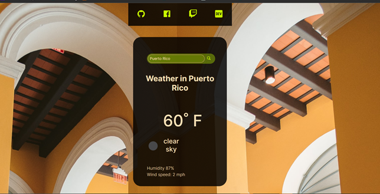

# My Weather App

[Click here to see it live](https://weatherapptiempo.netlify.app/)

### This is a Plain HTML, CSS and JS App

This is a great excercise to lever up the skills. I think is super important to solidify the fundamentals before jumping in to Frameworks and Libraries.

## Contents:

**Styles:**

Photo by <a href="https://unsplash.com/@blakeverdoorn?utm_source=unsplash&utm_medium=referral&utm_content=creditCopyText">Blake Verdoorn</a> on <a href="https://unsplash.com/s/photos/nature?utm_source=unsplash&utm_medium=referral&utm_content=creditCopyText">Unsplash</a>
  
  Photo by <a href="https://unsplash.com/@davehoefler?utm_source=unsplash&utm_medium=referral&utm_content=creditCopyText">Dave Hoefler</a> on <a href="https://unsplash.com/s/photos/nature?utm_source=unsplash&utm_medium=referral&utm_content=creditCopyText">Unsplash</a>

  Photo by <a href="https://unsplash.com/@momentsbyebba?utm_source=unsplash&utm_medium=referral&utm_content=creditCopyText">Ebba Thoresson</a> on <a href="https://unsplash.com/?utm_source=unsplash&utm_medium=referral&utm_content=creditCopyText">Unsplash</a>
  
Photo by <a href="https://unsplash.com/@r3dmax?utm_source=unsplash&utm_medium=referral&utm_content=creditCopyText">Jonatan Pie</a> on <a href="https://unsplash.com/s/photos/dark-nature?utm_source=unsplash&utm_medium=referral&utm_content=creditCopyText">Unsplash</a>
  

* Flexbox
* Grid

**API**
https://openweathermap.org/api
